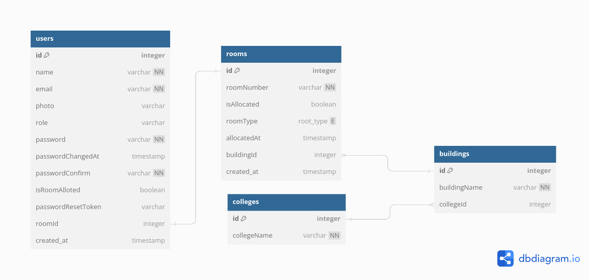

# ManageHostel Backend

This repo is the backend of the ManageHostel project. It provides various APIs to the client.

## Swagger API Documentation

[Documentation](https://managehostel-api.onrender.com/api/v1/docs/)

## Tech Stack

- [NodeJs](https://nodejs.org/en/about/)
- [Express](https://expressjs.com/)
- [MongoDB](https://www.mongodb.com/)
- [JWT](https://jwt.io/introduction)

# Getting Started

## Set up in Your local system

1. You must have git, nodejs and mongoDB installed in your local system.
2. Run MongoDB on PORT 27017.
3. Fork this repo and then clone the forked repo.
   ```sh
   git clone 'YOUR REPO LINK'
   ```
4. install dependencies and run the server
   ```sh
   npm install
   npm start
   ```
   This will make the server run at `http://localhost:8000/`


## Environment Variables

To run this project, you will need to add the following environment variables to your config.env file

### ./config.env

`PORT`

`NODE_ENV`

`DATABASE`

`DATABASE_PASSWORD`

`JWT_SECRET`

`JWT_EXPIRES_IN`

`JWT_COOKIE_EXPIRES_IN`

`EMAIL_USERNAME`

`EMAIL_PASSWORD`

## Database Schema


